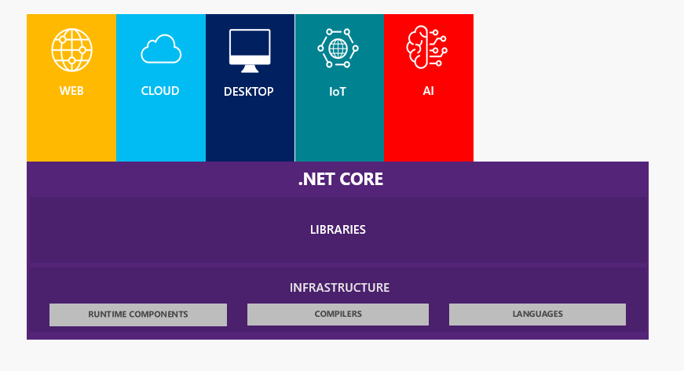
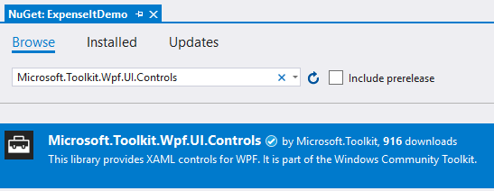
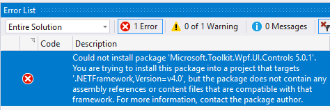
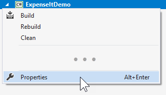
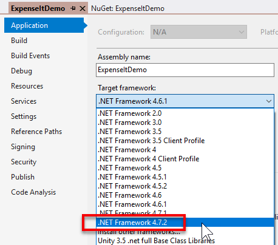
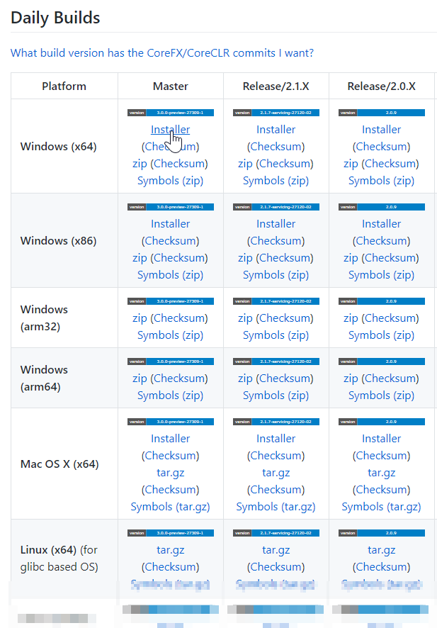

# Bring Fluent Design and modern user interaction to your WPF or Windows Forms applications

## Introduction
Windows 10 enables you to create modern applications thanks to the Universal Windows Platform (UWP). To benefit from the UWP Platform and its ecosystem, classic desktop applications have to be migrated. The migration paths are not trivial and may require a tremendous work ; Most of the time, it impose a full rewriting.

Now, with XAML Islands, we can use UWP controls in non-UWP desktop applications so that wa can enhance the look, feel, and functionality of your our LOB desktop applications with the latest Windows 10 UI features that are only available via UWP controls. This means that you can use UWP features such as Windows Ink and controls that support the Fluent Design System in your existing WPF, Windows Forms, and C++ Win32 applications.

With this lab, we will experiment XAML Islands and modernize an existing WPF application.

### Estimated time
90 minutes

### Objectives
- Learn how to modernize the user experience and the features of a desktop WPF application
- Learn how to leverage the Universal Windows Platforms without having to rewrite the app from scratch
- Use a bluit-in XAML Islands control in an existing WPF application
- Be able to 'integrate' any custom UWP XAML component in the WPF application
- Go further and perform bindings between the UWP XAML and the WPF application
- Understand how XAML Islands can help to start a progressive modernization journey to the Universal Windows Platform

### Prerequisites

- Experience in developing Windows Desktop applications with WPF
- Basic knowledge of C# and XAML
- Basic knowledge of UWP 

### Overview of the lab
We're going to start from an existing LOB application and we're going to enhance it by supporting modern features with the help of XAML Islands. We'll learn how to integrate Fluent controls from the Universal Windows Platform in the existing codebase.
The lab consists of three exercises:
1.  XXXXXXXXXXXXX
2.  YYYYYYYYYYYYYYYYY
3.  ZZZZZZZZZZZZZZZZZZZZ

### Computers in this lab
This lab uses a single Virtual Machine to provide you with the development environment.

The virtual machine is based on Windows 10 October Update (1809) and it includes:
- Visual Studio 2017
- Windows 10 SDK version 10.0.17763.0 or later

If you already have these tools on your computer, feel free to directly use it for the lab instead of the virtual machine. Be aware that the following Visual Studio workloads have to be installed: ".NET desktop development" and "Universal Windows Platform development".

### Scenario
The ExpenseIt application is internal application for creating expenses for Contoso Corporation. Modernizing this application is necessary in order to enhance employee efficiency when creating expenses reports.

### The project
ExpenseIt is a WPF Desktop application.

### Key concepts that will be used during the lab

#### Universal Windows Platform
Starting from Windows 8, Microsoft has introduced a new kind of applications: Windows Store apps, based on a new framework called Windows Runtime. Unlike the .NET Framework, the Windows Runtime is a native layer of APIs which are exposed directly by the operating system to applications which wants to consume them. With the goal to make the platform viable for every developer, the Windows Runtime has introduced language projections, which are layers added on top of the runtime to allow developers to interact with it using well-known and familiar languages. Thanks to projections, developers can build applications on top of the Windows Runtime leveraging the same C# and XAML knowledge they have acquired in building apps with the .NET Framework. The Windows Runtime libraries (called Windows Runtime Components) are described using special metadata files, which make it possible for developers to access the APIs using the specific syntax of the language they’re using. This way, projections can also respect the language conventions and types, like uppercase if you use C# or camel case if you use JavaScript. Additionally, Windows Runtime components can be used across multiple languages: for example, a Windows Runtime component written in C++ can be used by an application developed in C# and XAML.
With the release of Windows 10, Microsoft has introduced the Universal Windows Platform, which can be considered the successor of the Windows Runtime since it’s built on top of the same technology. The most important feature of the Universal Windows Platform is that it offers a common set of APIs across every platform: no matter if the app is running on a desktop, on a Xbox One or on a HoloLens, you’re able to use the same APIs to reach the same goals. This is a major step forward compared to the Windows Runtime, which didn’t provide this kind of cross-device support. You were able to share code and UI between a PC project and a mobile project, but, in the end, developers needed anyway to create, maintain and deploy two different solutions.

The Universal Windows Platform has been built with security and privacy in mind. As such, Universal Windows Platform applications run inside a sandbox; they don’t have access to the registry; they can freely read and write data only in a specific local folder; etc. Any operation which is potentially dangerous requires the declaration of a capability and the consent of the user: some examples are accessing to the files in the Pictures library; using the microphone or the webcam; retrieving the location of the user; etc. Everything is controlled by a manifest file, which is an XML file that describes the identity of the application: its unique identifier, its capabilities, its visual aspect, its integration with the Windows 10 ecosystem, etc.

#### Desktop Bridge
With the introduction of Windows Store apps first and Universal Windows Platform apps later, Microsoft has also introduced a new packaging modell called MSIX (formerly known as AppX), which is very different from the existing deployment models (like MSI). It's completely controlled by the operating system; it can be used to deploy applications not only using traditional approaches, like the web, SSCM, Intune, but it opens up now opportunities like the Microsoft Store / Store for Business / Store for Education.

With the release of Windows 10 Anniversary Update, this new format has been expanded to support not only modern applications, but also the existing ones built with traditional Win32 technologies, like WPF, Windows Forms, Java, Electron, etc. **Desktop Bridge** is the name of the technology that has enabled this feature, allowing developers to release their Win32 applications also on the Microsoft Store. Another key feature of Desktop Bridge is that it enables Win32 applications to have an identity, which opens up the opportunity to consume APIs from the Universal Windows Platform. 

When a Win32 application runs packaged with the Desktop Bridge, it's executed inside a lightweight container which helps to improve the security and the reliability of the application. The container enables three features:

- A **Virtual File System**. Each package can contain a folder, called **VFS**, which maps all the main system folders, like *C:\Windows*, *C:\Program Files*, etc. When the application looks for a file in one of these folders, Windows will look first inside the Virtual File System and, only if it can't find it, will redirect the call to the real file system. Thanks to this feature you can create self-deployable packages, which don't need the user to manually install 3rd party dependencies like frameworks, libraries, etc. Additionally, you can solve the problem known as **DLL hell**, which can happen when you have on a system multiple applications which depend by different versions of the same system framework or library. Since you can bundle the most appropriate version of the framework in each package, it won't interfere with any other application or framework already installed on the machine.
- A **virtualized registry**. All the writing operation to the HKEY_CURRENT_USER hive of the registry are stored in a binary file which is unique for each application. This way the application doesn't have the opportunity to interfere with the real registry. And when the user uninstalls the application, the binary file is simply deleted, making sure that no orphan registry keys are left in the system.
- A **virtualized file system**. As a best practice in Windows development, all the data generated by an application which is tightly coupled to it (a database, log files, temporary files, etc.) should be saved in the AppData folder, which lives under the user's space. In a packaged application, all the reading and writing operations against the AppData folder are automatically redirected to the local folder, which is unique for an application. This approach helps to keep the system efficient and reliable since, when the user uninstalls the application, the local folder is simply deleted, making sure there are no orphan files left in the system.

Desktop Bridge plays an important role with XAML Island because, by combining these two technologies, you'll be able to leverage the same time features and user controls of the Universal Windows Platform without rewriting it from scratch with another technology. Additionally, as soon as you need to interact with any UWP control, your application must be packaged with the Desktop Bridge, since all the controls, properties, event handlers, etc. are exposed by the Universal Windows Platform.

#### XAML Islands architecture
The Windows 10 October 2018 Update with the SDK 17763, enables the scenario of XAML Islands for Desktop applications. That means that Windows 10 now supports hosting UWP controls inside the context of a Win32 Process. The 'magic' is powered by two new system APIs called <a href="https://docs.microsoft.com/en-us/uwp/api/windows.ui.xaml.hosting.windowsxamlmanager" target="_blank">WindowsXamlManager</a> and <a href="https://docs.microsoft.com/en-us/uwp/api/windows.ui.xaml.hosting.desktopwindowxamlsource" target="_blank">DesktopWindowXamlSource</a>.

- The WindowsXamlManager handles the UWP XAML Framework. As such, the only exposed method is called **InitializeForCurrentThread()**, which takes care of initializing the UWP XAML Framework inside the current thread of a non-Win32 Desktop app, so that you can start adding UWP controls to it.
- The DesktopWindowXamlSource is the actual instance of your Island content. It has a Content property which you can instantiate and set with the control you want to render. 

With an instance of the DesktopWindowXamlSource class you can attach it’s HWND to any parent HWND you want from your native Win32 App. This enables any framework that exposes HWND to host a XAML Island, including 3rd party technologies like Java or Delphi.
However, when it comes to WPF and Windows Forms applications, you don’t have to manually do that thanks to the Windows Community Toolkit, since it already wraps these classes into ready-to-be-used controls.

The Windows Community Toolkit is an open-source project, maintained by Microsoft and driven by the community, which includs many custom controls, helpers and service to speed up the development of Windows applications. Starting from version 5.0, the toolkit includes 4 packages to enable XAML Island: 

- One called **XamlHost**. It's a generic control that can host any UWP control, either custom or native. It comes in two variants: [Microsoft.Toolkit.Wpf.UI.XamlHost](https://www.nuget.org/packages/Microsoft.Toolkit.Wpf.UI.XamlHost/) for WPF and [Microsoft.Toolkit.Forms.UI.XamlHost](https://www.nuget.org/packages/Microsoft.Toolkit.Forms.UI.XamlHost/) for Windows Forms.
- One called **Controls**, which includes wrappers for 1st party controls like Map or InkCanvas. Thanks to these controls, you'll be able to leverage them like if they're native WPF or Windows Forms control, including direct access to the exposed properties and binding support. Also in this case, it comes into two variants: [Microsoft.Toolkit.Wpf.UI.Controls](https://www.nuget.org/packages/Microsoft.Toolkit.Wpf.UI.Controls/) for WPF and [Microsoft.Toolkit.Forms.UI.Controls](https://www.nuget.org/packages/Microsoft.Toolkit.Forms.UI.Controls/) for Windows Forms.


#### .NET Core 3
.NET Core is a open-source framework built from scratch which brings all the goodies of the .NET Framework into the new modern world. Unlike the full .NET Framework, which has its roots deeply integrated into Windows, .NET Core is cross-platform, lightweight and easily extensible.

Until today, .NET Core has always been focused on supporting these new requirements. As such, its primary workload has always been web or back-end applications. Thanks to .NET Core, you can build easily scalable web applications or APIs that can be hosted on Windows, Linux, or in micro services architectures like Docker containers.

At BUILD 2018 we have announced the next major release of .NET Core, 3.0, which is, without any doubts, the biggest and most ambitious release since the first version. On top of .NET Core 3.0, in fact, we'll be able to build new workloads.



As you can see from the image, for the first time .NET Core will support not just web and back-end applications, but also desktop ones which, until today, have always been part only of the full traditional .NET Framework.

> **Disclaimer:** This doesn't mean that WPF and Windows Forms will become cross-platform and you'll be able to run a Windows desktop application, as it is, also on Linux and MacOS. The UI piece of the two frameworks still has a dependency on the Windows rendering system and, as such, it can't run on platforms which use instead a different visual rendering system.
> 

What are the main benefits of running a desktop application on top of .NET Core? Essentially performance and side-by-side support.

##### Performance improvements.
Key investments in .NET Core were made around performances. Startup time is much faster and most of the APIs have been rewritten to be fully optimized. This is true for server side and client side workloads.

##### Side-by-side support
One of the biggest blockers for enterprises to adopt newer versions of the .NET Framework is that it can be installed only at system level and it automatically comes with newer version of Windows. This means that if you have an application which targets .NET Framework 4.5 and you want to update it to take advantage of some of the improvements delivered by .NET Framework 4.7, you are forced to update all the applications (or, at least, to make sure they still run well) at the same time. The reason is that you can't install the .NET Framework 4.7 side-by-side with .NET Framework 4.5, but you have to update the existing 4.5 installation. This isn't a nightmare only for enterprises, but a big blocker also for Microsoft. If you look at the recent history of .NET Framework, you will notice how every upgrade brings mainly fixes and minor improvements. The reason is that, since we need to make sure to maintain backward compatibility, the team can't be agile and evolve the framework with changes that, potentially, can break older apps. Checking new code into the .NET Framework requires a long validation and testing period. You can read some thoughts from the team on this in the following article.

.NET Core, instead, can run truly side-by-side, with two different approaches:

- You can embed the runtime inside the application. This way you'll be able to deploy the app on any machine, even without the runtime installed, and make sure it will target the specific .NET Core version you have used to build it.
- You can install multiple .NET Core runtimes on the same machine. Unlike with the .NET Framework, you can have on the same machine .NET Core 1.0, .NET Core 2.0, .NET Core 3.0 and whatever .NET Core version will ship in the future. This means that if you deploy an application which runs on .NET Core 2.0, it will effectively leverage the .NET Core 2.0 runtime and not another runtime in backward compatibility mode.

Additionally, you will be able to leverage many of the benefits of the .NET Core ecosystem, like the opportunity to use the command line tools to create and build your projects or to use the improved .csproj format. In the end, .NET Core 3.0 will bring some specific benefits for desktop development, like a better support to high DPI screens or the opportunity to leverage all the UWP APIs.

##### Why .NET Core 3 for XAML Islands
You should wonder where .NET Core plays a role here. Of course for performance startup and execution of the WPF application : This is the good and immediate gain. The long term advantage is really the fact that this is the migration path for modernizing .NET WPF and Windows Forms applications. Moreover, you will see in Exercise 3 that is best way to fully support the full UWP platform.

___
## Exercise 1 - Use a 1st party UWP control with XAML Islands
We start with the simpliest modernization path possible: We would like to use a rich UWP control that is 'available for use in WPF'. Crazy idea? No! Indeed, the most requested controls are already wrapped for you! The current XAML Islands iteration brings you the InkCanvas, the InkToolbar, the MapControl and the MediaPlayerElement.
So in our Expense application, we will bring a modern touch by using the MapControl. This will be possible thanks to the Microsoft.Toolkit.Wpf.UI.Controls NuGet package.

### Task 1 - Setup the ExpenseIt solution
Let's first be sure we can run and debug the ExpenseIt solution locally.
1.  In the Windows Explorer, create a new local folder like *"C:\XAMLIslandsLab"*. It will be our working folder for the Contoso Dashboard website.
2.  In order to get the source code of the ExpenseIt solution, go to <a href="https://github.com/Microsoft/Windows-AppConsult-XAMLIslandsLab/tree/master/" target="_blank">Windows AppConsult XAMLIslaLab repository</a>. Click on the **releases** tab and donwload the latest release.

3.  When ready, click on the downloaded file in your browser to open it.

    

4.  Open the zip file and extract all the content to your working folder "C:\XAMLIslandsLab" you've just created.

5.  Open Visual Studio 2017, and double click on the *"C:\XAMLIslandsLab\Lab\Exercise1\01-Start\ExpenseIt.sln"* file to open the solution.

    

7.  Verify that you can debug the ExpenseIt WPF project by pressing the **Start** button or CTRL+F5.

### Task 2 - Reference the "Microsoft.Toolkit.Wpf.UI.Controls" NuGet package
We need this WPF package because it takes care for us about all the necessary piping for XAML Islands. It provides wrapper classes for 1st party controls, such as the InkCanvas, InkToolbar, MapControl, and MediaPlayerElement, all for WPF.

Please note that the same package exists for Windows Forms. Its name is <a href="https://www.nuget.org/packages/Microsoft.Toolkit.Forms.UI.Controls/" target="_blank">Microsoft.Toolkit.Forms.UI.Controls</a>.

1.  If the ExpensIt solution is not opened in Visual Studio, double click on *"C:\XAMLIslandsLab\ExpenseIt.sln"*.
2.  Right click on the **ExpenseIt** project in the Solution Explorer window on the left and choose **Manage NuGet Packages...**.

    

3. Search for "Microsoft.Toolkit.Wpf.UI.Controls". The NuGet package from Microsoft.Toolkit will be displayed.

    

4.  Click on the **Install** button on the right.

    

5. You might get the following error.

    

This error gives us the opportunity to mention the requirement for the .NET WPF or Windows Forms application: **The .NET Framework version has to be > 4.6.2**. Let's retarget the ExpenseIt project to this version.

6.  Right click on the ExpenseIt project / **Properties**.

    

7.  In the **Target framework** dropdown listbox, select the **.NET Framework 4.7.2** (as this version is installed on the box).

    

8. Rebuild the project using the **CTRL+SHIFT+B** shortcut in order to check if the retargeting action haven't caused any regression or ask us to do some manual code modifications.

    ```dos
    1>------ Build started: Project: ExpenseItDemo, Configuration: Debug Any CPU ------
    1>  ExpenseItDemo -> C:\XAMLIslandsLab\ExpenseItDemo\bin\Debug\ExpenseItDemo.exe
    ========== Build: 1 succeeded, 0 failed, 1 up-to-date, 0 skipped ==========
    ```

9.  It is now safe to add the **Microsoft.Toolkit.Wpf.UI.Controls** NuGet package to the ExpenseIt project as explained above.

### Task 3 - Use the MapControl in the application
TODO: Find an interesting way to use the MapControl


___
## Exercise 2 - Integrate a custom UWP XAML component
TODO

### Task 1 - Reference the XAML Islands host conctrol
1.  With the ExpenseIt solution opened in Visual Studio, right click on the ExpenseIt project and then **Manage NuGet Packages...**

    

2.  Search for the "Microsoft.Toolkit.Wpf.UI.XamlHost" package.

    

3.  Click on the **Install** button.

    


___
## Exercise 3 - Migrate to .NET Core
Migrating the application to .NET Core 3 is, from far, the best and recomanded path for modernazing a .NET application (WPF or Windows Forms). As previously mentionned, the first really nice improvment is about the startup and execution time! This is only the emerged part of the iceberg. The best advantage is that, the app will be able to use all the upcoming new features both from .NET Core and UWP! 

### Setup for using .NET Core today

At the moment of writing .NET Core is still in Preview and it is highly experimental technologies. Nevertheless, it is enough stable to play with it. The minimum required is made of two pieces:
- The .NET Core 3 runtime - https://github.com/dotnet/core-setup
- The .NET Core 3 SDK - https://github.com/dotnet/core-sdk

Do not worry, using the VM provided, all is already setup for you: You do not have to download and install anything. If you are using you own computer, just navigate to the two links above and find the correct installer for your platform.




___
## Exercise 4 - Perform bindings between UWP XAML and WPF
TODO

### Task 1 - TODO
TODO

### Task 2 - TODO
TODO


