# Bring Fluent Design and modern user interaction to your WPF or Windows Forms applications

## Introduction
Windows 10 enables you to create modern applications thanks to the Universal Windows Platform (UWP). To benefit from the UWP Platform and its ecosystem, classic desktop applications have to be migrated. The migration paths are not trivial and may require a tremendous work ; Most of the time, it impose a full rewriting.

Now, with XAML Islands, we can use UWP controls in non-UWP desktop applications so that wa can enhance the look, feel, and functionality of your our LOB desktop applications with the latest Windows 10 UI features that are only available via UWP controls. This means that you can use UWP features such as Windows Ink and controls that support the Fluent Design System in your existing WPF, Windows Forms, and C++ Win32 applications.

With this lab, we will experiment XAML Islands and modernize an existing WPF application.

### Estimated time
90 minutes

### Objectives
- Learn how to modernize the user experience and the features of a desktop WPF application
- Learn how to leverage the Universal Windows Platforms without having to rewrite the app from scratch
- Use a bluit-in XAML Islands control in an existing WPF application
- Be able to 'integrate' any custom UWP XAML component in the WPF application
- Go further and perform bindings between the UWP XAML and the WPF application
- Understand how XAML Islands can help to start a progressive modernization journey to the Universal Windows Platform

### Prerequisites

- Experience in developing Windows Desktop applications with WPF
- Basic knowledge of C# and XAML
- Basic knowledge of UWP 

### Overview of the lab
We're going to start from an existing LOB application and we're going to enhance it by supporting modern features with the help of XAML Islands. We'll learn how to integrate Fluent controls from the Universal Windows Platform in the existing codebase.
The lab consists of three exercises:
1.  XXXXXXXXXXXXX
2.  YYYYYYYYYYYYYYYYY
3.  ZZZZZZZZZZZZZZZZZZZZ

### Computers in this lab
This lab uses a single Virtual Machine to provide you with the development environment.

The virtual machine is based on Windows 10 October Update (1809) and it includes:
- Visual Studio 2017
- Windows 10 SDK version 10.0.17763.0 or later

If you already have these tools on your computer, feel free to directly use it for the lab instead of the virtual machine. Be aware that the following Visual Studio workloads have to be installed: ".NET desktop development" and "Universal Windows Platform development".

### Scenario
The ExpenseIt application is internal application for creating expenses for Contoso Corporation. Modernizing this application is necessary in order to enhance employee efficiency when creating expenses reports.

### The project
ExpenseIt is a WPF Desktop application.

### Key concepts that will be used during the lab

**Please note**. The following information are provided in case you're planning to follow this lab on your own or from home. If you are following this lab as part of a live training class, feel free to skip it and jump directly to the beginning of the first exercise. These concepts, in fact, should have already be explained by the trainers of the lab before starting the practical exercises.

#### Universal Windows Platform
Starting from Windows 8, Microsoft has introduced a new kind of applications: Windows Store apps, based on a new framework called Windows Runtime. Unlike the .NET Framework, the Windows Runtime is a native layer of APIs which are exposed directly by the operating system to applications which want to consume them. With the goal to make the platform viable for every developer, the Windows Runtime has introduced language projections, which are layers added on top of the runtime to allow developers to interact with it using well-known and familiar languages. Thanks to projections, developers can build applications on top of the Windows Runtime leveraging the same C# and XAML knowledge they have acquired in building apps with the .NET Framework. The Windows Runtime libraries (called Windows Runtime Components) are described using special metadata files, which make it possible for developers to access the APIs using the specific syntax of the language they’re using. This way, projections can also respect the language conventions and types, like uppercase if you use C# or camel case if you use JavaScript. Additionally, Windows Runtime components can be used across multiple languages: for example, a Windows Runtime component written in C++ can be used by an application developed in C# and XAML.
With the release of Windows 10, Microsoft has introduced the Universal Windows Platform, which can be considered the successor of the Windows Runtime since it’s built on top of the same technology. The most important feature of the Universal Windows Platform is that it offers a common set of APIs across every platform: no matter if the app is running on a desktop, on a Xbox One or on a HoloLens, you’re able to use the same APIs to reach the same goals. This is a major step forward compared to the Windows Runtime, which didn’t provide this kind of cross-device support. You were able to share code and UI between a PC project and a mobile project, but, in the end, developers needed anyway to create, maintain and deploy two different solutions.

The Universal Windows Platform has been built with security and privacy in mind. As such, Universal Windows Platform applications run inside a sandbox; they don’t have access to the registry; they can freely read and write data only in a specific local folder; etc. Any operation which is potentially dangerous requires the declaration of a capability and the consent of the user: some examples are accessing to the files in the Pictures library; using the microphone or the webcam; retrieving the location of the user; etc. Everything is controlled by a manifest file, which is an XML file that describes the identity of the application: its unique identifier, its capabilities, its visual aspect, its integration with the Windows 10 ecosystem, etc.

Last but not the least, all the investments of the Windows team for developers are focused on the Universal Windows Platform. All the latest features added in Windows 10, like Timeline, Project Rome, Windows Hello, etc. are exposed by the Universal Windows Platform, so that developers can integrate them in their applications.

#### Desktop Bridge
With the introduction of Windows Store apps first and Universal Windows Platform apps later, Microsoft has also introduced a new packaging modell called MSIX (formerly known as AppX), which is very different from the existing deployment models (like MSI). It's completely controlled by the operating system; it can be used to deploy applications not only using traditional approaches, like the web, SSCM, Intune, but it opens up now opportunities like the Microsoft Store / Store for Business / Store for Education.

With the release of Windows 10 Anniversary Update, this new format has been expanded to support not only modern applications, but also the existing ones built with traditional Win32 technologies, like WPF, Windows Forms, Java, Electron, etc. **Desktop Bridge** is the name of the technology that has enabled this feature, allowing developers to release their Win32 applications also on the Microsoft Store. Another key feature of Desktop Bridge is that it enables Win32 applications to have an identity, which opens up the opportunity to consume APIs from the Universal Windows Platform. 

When a Win32 application runs packaged with the Desktop Bridge, it's executed inside a lightweight container which helps to improve the security and the reliability of the application. The container enables three features:

- A **Virtual File System**. Each package can contain a folder, called **VFS**, which maps all the main system folders, like *C:\Windows*, *C:\Program Files*, etc. When the application looks for a file in one of these folders, Windows will look first inside the Virtual File System and, only if it can't find it, will redirect the call to the real file system. Thanks to this feature you can create self-deployable packages, which don't need the user to manually install 3rd party dependencies like frameworks, libraries, etc. Additionally, you can solve the problem known as **DLL hell**, which can happen when you have on a system multiple applications which depend by different versions of the same system framework or library. Since you can bundle the most appropriate version of the framework in each package, it won't interfere with any other application or framework already installed on the machine.
- A **virtualized registry**. All the writing operation to the HKEY_CURRENT_USER hive of the registry are stored in a binary file which is unique for each application. This way the application doesn't have the opportunity to interfere with the real registry. And when the user uninstalls the application, the binary file is simply deleted, making sure that no orphan registry keys are left in the system.
- A **virtualized file system**. As a best practice in Windows development, all the data generated by an application which is tightly coupled to it (a database, log files, temporary files, etc.) should be saved in the AppData folder, which lives under the user's space. In a packaged application, all the reading and writing operations against the AppData folder are automatically redirected to the local folder, which is unique for an application. This approach helps to keep the system efficient and reliable since, when the user uninstalls the application, the local folder is simply deleted, making sure there are no orphan files left in the system.

Desktop Bridge plays an important role with XAML Island because, by combining these two technologies, you'll be able to leverage the same time features and user controls of the Universal Windows Platform without rewriting it from scratch with another technology. 

#### XAML Islands architecture
The Windows 10 October 2018 Update with the SDK 17763, enables the scenario of XAML Islands for Desktop applications. That means that Windows 10 now supports hosting UWP controls inside the context of a Win32 Process. The 'magic' is powered by two new system APIs called <a href="https://docs.microsoft.com/en-us/uwp/api/windows.ui.xaml.hosting.windowsxamlmanager" target="_blank">WindowsXamlManager</a> and <a href="https://docs.microsoft.com/en-us/uwp/api/windows.ui.xaml.hosting.desktopwindowxamlsource" target="_blank">DesktopWindowXamlSource</a>.

- The **WindowsXamlManager** handles the UWP XAML Framework. As such, the only exposed method is called **InitializeForCurrentThread()**, which takes care of initializing the UWP XAML Framework inside the current thread of a non-Win32 Desktop app, so that you can start adding UWP controls to it.
- The **DesktopWindowXamlSource** is the actual instance of your Island content. It has a **Content** property which you can instantiate and set with the control you want to render. 

With an instance of the **DesktopWindowXamlSource** class you can attach it’s HWND to any parent HWND you want from your native Win32 App. This enables any framework that exposes HWND to host a XAML Island, including 3rd party technologies like Java or Delphi.
However, when it comes to WPF and Windows Forms applications, you don’t have to manually do that thanks to the Windows Community Toolkit, since it already wraps these classes into ready-to-be-used controls.

[The Windows Community Toolkit](https://docs.microsoft.com/en-us/windows/communitytoolkit/
) is an open-source project, maintained by Microsoft and driven by the community, which includs many custom controls, helpers and service to speed up the development of Windows applications. Starting from version 5.0, the toolkit includes 4 packages to enable XAML Island: 

- One called **XamlHost**. It's a generic control that can host any UWP control, either custom or native. It comes in two variants: [Microsoft.Toolkit.Wpf.UI.XamlHost](https://www.nuget.org/packages/Microsoft.Toolkit.Wpf.UI.XamlHost/) for WPF and [Microsoft.Toolkit.Forms.UI.XamlHost](https://www.nuget.org/packages/Microsoft.Toolkit.Forms.UI.XamlHost/) for Windows Forms.
- One called **Controls**, which includes wrappers for 1st party controls like Map or InkCanvas. Thanks to these controls, you'll be able to leverage them like if they're native WPF or Windows Forms control, including direct access to the exposed properties and binding support. Also in this case, it comes into two variants: [Microsoft.Toolkit.Wpf.UI.Controls](https://www.nuget.org/packages/Microsoft.Toolkit.Wpf.UI.Controls/) for WPF and [Microsoft.Toolkit.Forms.UI.Controls](https://www.nuget.org/packages/Microsoft.Toolkit.Forms.UI.Controls/) for Windows Forms.


#### .NET Core 3
.NET Core is a open-source framework built from scratch which brings all the goodies of the .NET Framework into the new modern world. Unlike the full .NET Framework, which has its roots deeply integrated into Windows, .NET Core is cross-platform, lightweight and easily extensible.

Until today, .NET Core has always been focused on supporting these new requirements. As such, its primary workload has always been web or back-end applications. Thanks to .NET Core, you can build easily scalable web applications or APIs that can be hosted on Windows, Linux, or in micro services architectures like Docker containers.

At BUILD 2018 we have announced the next major release of .NET Core, 3.0, which is, without any doubts, the biggest and most ambitious release since the first version. On top of .NET Core 3.0, in fact, we'll be able to build new workloads.


As you can see from the image, for the first time .NET Core will support not just web and back-end applications, but also desktop ones which, until today, have always been part only of the full traditional .NET Framework.

> **Disclaimer:** This doesn't mean that WPF and Windows Forms will become cross-platform and you'll be able to run a Windows desktop application, as it is, also on Linux and MacOS. The UI piece of the two frameworks still has a dependency on the Windows rendering system and, as such, it can't run on platforms which use instead a different visual rendering system.
> 

What are the main benefits of running a desktop application on top of .NET Core? Essentially performance and side-by-side support.

##### Performance improvements.
Key investments in .NET Core were made around performances. Startup time is much faster and most of the APIs have been rewritten to be fully optimized. This is true for server side and client side workloads.

##### Side-by-side support
One of the biggest blockers for enterprises to adopt newer versions of the .NET Framework is that it can be installed only at system level and it automatically comes with newer version of Windows. This means that if you have an application which targets .NET Framework 4.5 and you want to update it to take advantage of some of the improvements delivered by .NET Framework 4.7, you are forced to update all the applications (or, at least, to make sure they still run well) at the same time. The reason is that you can't install the .NET Framework 4.7 side-by-side with .NET Framework 4.5, but you have to update the existing 4.5 installation. This isn't a nightmare only for enterprises, but a big blocker also for Microsoft. If you look at the recent history of .NET Framework, you will notice how every upgrade brings mainly fixes and minor improvements. The reason is that, since we need to make sure to maintain backward compatibility, the team can't be agile and evolve the framework with changes that, potentially, can break older apps. Checking new code into the .NET Framework requires a long validation and testing period. You can read some thoughts from the team on this in the following article.

.NET Core, instead, can run truly side-by-side, with two different approaches:

- You can embed the runtime inside the application. This way you'll be able to deploy the app on any machine, even without the runtime installed, and make sure it will target the specific .NET Core version you have used to build it.
- You can install multiple .NET Core runtimes on the same machine. Unlike with the .NET Framework, you can have on the same machine .NET Core 1.0, .NET Core 2.0, .NET Core 3.0 and whatever .NET Core version will ship in the future. This means that if you deploy an application which runs on .NET Core 2.0, it will effectively leverage the .NET Core 2.0 runtime and not another runtime in backward compatibility mode.

Additionally, you will be able to leverage many of the benefits of the .NET Core ecosystem, like the opportunity to use the command line tools to create and build your projects or to use the improved .csproj format. In the end, .NET Core 3.0 will bring some specific benefits for desktop development, like a better support to high DPI screens or the opportunity to leverage all the UWP APIs.

##### Why .NET Core 3 for XAML Islands
You should wonder where .NET Core plays a role here. Of course for performance startup and execution of the WPF application : This is the good and immediate gain. The long term advantage is really the fact that this is the migration path for modernizing .NET WPF and Windows Forms applications. Moreover, you will see in Exercise 3 that is best way to fully support the full UWP platform.

___
## Exercise 1 - Use a 1st party UWP control with XAML Islands
We start with the simpliest modernization path possible: We would like to use a rich UWP control that is 'available for use in WPF'. Crazy idea? No! Indeed, the most requested controls are already wrapped for you! The current XAML Islands iteration brings you the InkCanvas, the InkToolbar, the MapControl and the MediaPlayerElement.
So in our Expense application, we will bring a modern touch by using the MapControl. This will be possible thanks to the Microsoft.Toolkit.Wpf.UI.Controls NuGet package.

### Task 1 - Setup the ExpenseIt solution
Let's first be sure we can run and debug the ExpenseIt solution locally.
1.  In the Windows Explorer, create a new local folder like *"C:\XAMLIslandsLab"*. It will be our working folder for the Contoso Dashboard website.
2.  In order to get the source code of the ExpenseIt solution, go to <a href="https://github.com/Microsoft/Windows-AppConsult-XAMLIslandsLab/tree/master/" target="_blank">Windows AppConsult XAMLIslaLab repository</a>. Click on the **releases** tab and donwload the latest release.

3.  When ready, click on the downloaded file in your browser to open it.

    

4.  Open the zip file and extract all the content to your working folder "C:\XAMLIslandsLab" you've just created.

5.  Open Visual Studio 2017, and double click on the *"C:\XAMLIslandsLab\Lab\Exercise1\01-Start\ExpenseIt.sln"* file to open the solution.

    

7.  Verify that you can debug the ExpenseIt WPF project by pressing the **Start** button or CTRL+F5.

### Task 2 - Reference the "Microsoft.Toolkit.Wpf.UI.Controls" NuGet package
We need this WPF package because it takes care for us about all the necessary piping for XAML Islands. It provides wrapper classes for 1st party controls, such as the InkCanvas, InkToolbar, MapControl, and MediaPlayerElement, all for WPF.

Please note that the same package exists for Windows Forms. Its name is <a href="https://www.nuget.org/packages/Microsoft.Toolkit.Forms.UI.Controls/" target="_blank">Microsoft.Toolkit.Forms.UI.Controls</a>.

1.  If the ExpensIt solution is not opened in Visual Studio, double click on *"C:\XAMLIslandsLab\ExpenseIt.sln"*.
2.  Right click on the **ExpenseIt** project in the Solution Explorer window on the left and choose **Manage NuGet Packages...**.

    

3. Search for "Microsoft.Toolkit.Wpf.UI.Controls". The NuGet package from Microsoft.Toolkit will be displayed.

    

4.  Click on the **Install** button on the right.

    

5. You might get the following error.

    

This error gives us the opportunity to mention the requirement for the .NET WPF or Windows Forms application: **The .NET Framework version has to be > 4.6.2**. Let's retarget the ExpenseIt project to this version.

6.  Right click on the ExpenseIt project / **Properties**.

    

7.  In the **Target framework** dropdown listbox, select the **.NET Framework 4.7.2** (as this version is installed on the box).

    

8. Rebuild the project using the **CTRL+SHIFT+B** shortcut in order to check if the retargeting action haven't caused any regression or ask us to do some manual code modifications.

    ```dos
    1>------ Build started: Project: ExpenseItDemo, Configuration: Debug Any CPU ------
    1>  ExpenseItDemo -> C:\XAMLIslandsLab\ExpenseItDemo\bin\Debug\ExpenseItDemo.exe
    ========== Build: 1 succeeded, 0 failed, 1 up-to-date, 0 skipped ==========
    ```

9.  It is now safe to add the **Microsoft.Toolkit.Wpf.UI.Controls** NuGet package to the ExpenseIt project as explained above.

### Task 3 - Use the InkCanvas control in the application
One of the features that the development team is looking to integrate inside the application is support to digital signature. Managers wants to be able to easily sign the expenses reports, without having to print and digitalize them back.
XAML Island is the perfect candidate for this scenario, since the Universal Windows Platform includes a control called **InkCanvas**, which offers advanced support to digital pens. Additionally, it includes many AI powered features, like the capability to recognize text, shapes, etc.

Adding it to a WPF application is easy, since it's one of the 1st party controls included in the Windows Community Toolkit we have just installed. Let's add it!

1. Go back to Visual Studio and double click on the **ExpenseDetail.xaml** file in Solution Explorer.
2. As first step, we need to add a new XAML namespace, since the control we need is part of a 3rd party library. Locate the **<Window>** tag at the top of the XAML file.
3. Copy and paste the following definition as attribute of the **Window** element:

    ```xml
    xmlns:toolkit="clr-namespace:Microsoft.Toolkit.Wpf.UI.Controls;assembly=Microsoft.Toolkit.Wpf.UI.Controls"
    ```
    This is how the complete definition should look like:
    
    ```xml
    <Window x:Class="ContosoExpenses.ExpenseDetail"
            xmlns="http://schemas.microsoft.com/winfx/2006/xaml/presentation"
            xmlns:x="http://schemas.microsoft.com/winfx/2006/xaml"
            xmlns:d="http://schemas.microsoft.com/expression/blend/2008"
            xmlns:mc="http://schemas.openxmlformats.org/markup-compatibility/2006"
            xmlns:toolkit="clr-namespace:Microsoft.Toolkit.Wpf.UI.Controls;assembly=Microsoft.Toolkit.Wpf.UI.Controls"
            Loaded="Window_Loaded"
            xmlns:local="clr-namespace:ContosoExpenses"
            mc:Ignorable="d"
            Title="Expense Detail" Height="500" Width="800"
            Background="{StaticResource HorizontalBackground}">
    ```
4. Now we can add the **InkCanvas** control to the page. We're going to add two new rows to the **Grid** to fit it.
5. Add two new **RowDefinition** tags at the end the **Grid.Row** collection: one with **Height** equal to **Auto**, the other one equal to *. This is how the final result should look like:

    ```xml
    <Grid.RowDefinitions>
        <RowDefinition Height="Auto"/>
        <RowDefinition Height="Auto"/>
        <RowDefinition Height="Auto"/>
        <RowDefinition Height="Auto"/>
        <RowDefinition Height="Auto"/>
        <RowDefinition Height="Auto"/>
        <RowDefinition Height="*"/>
    </Grid.RowDefinitions>
    ```
    
6. Now move to the bottom of the XAML file and, inside the **Grid** control, add the following code:

    ```xml
    <TextBlock Text="Signature:" FontSize="16" FontWeight="Bold" Grid.Row="5" />
                
    <toolkit:InkCanvas x:Name="Signature" Grid.Row="6" />
    ```

    The first control is a simple **TextBlock**, used as a header. The second one is real **InkCanvas** control, which is prefixed by the **toolkit** keyword we have defined as namespace, being a 3rd party control.
    
7. That's it! Now we can test the application. Press F5 to launch the debugging experience.
8. Choose an employee from the list, then one of the available expenses.
9. Notice that, in the expense detail page, there's a new space for the **InkCanvas** control. If you have a device which supports a digital pen, like a Surface, go on and try to use it. You will see the digital ink appearing on the screen. However, if you don't have a pen capable device and you try to sign with your mouse, nothing will happen. This is happening because, by default, the **InkCanvas** control is enabled only for digital pens. However, we can change this behavior.
10. Stop the debugger and double click on the **ExpenseDetail.xaml.cs** file in Visual Studio.
11. Add the following namespace declaration at the top of the class:

    ```csharp
    using Microsoft.Toolkit.Win32.UI.Controls.Interop.WinRT;
    ```
    
12. Now locate the **ExpenseDetail()** method, which is the public constructor of the class.
13. Add the following line of code right after the **InitializeComponent()** method:

    ```csharp
    Signature.InkPresenter.InputDeviceTypes = CoreInputDeviceTypes.Mouse | CoreInputDeviceTypes.Pen;
    ```
    
    **InkPresenter** is an object exposed by the **InkCanvas** control which we can use to customize the default inking experience. Thanks to the **InputDeviceTypes** we can change which inking devices are supported. Thanks to the values offered by the **CoreInputDeviceTypes** enumerator, we enable pen and mouse.
    
14. Now let's test the application again. Press F5 to start the debugging, then choose one of the employees followed by one of the expenses.
15. Try now to draw something in the signature space with the mouse. This time, you'll see the ink appearing on the screen.

    
    
However, if you try to play a bit with the application you will notice that not everything is working as expected. Close the expense detail and try to open another one from the list. You will notice that the application will crash with the following exception:

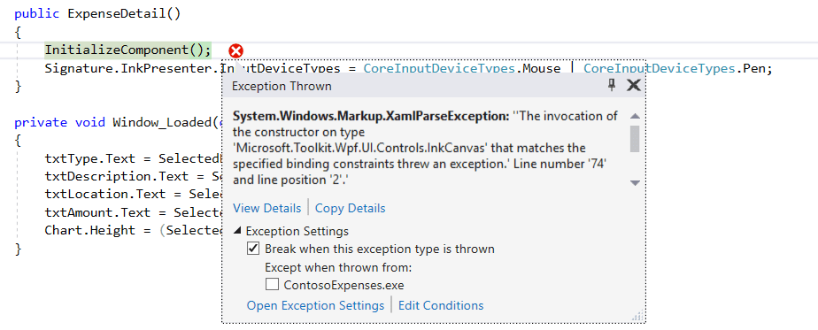

The reason is that every UWP control included in a WPF app through XAML Island must be properly disposed before being instantiated again. As such, we need to take care of this operation when the expense detail page is closed.

1. Go back to Visual Studio and double click the **ExpenseDetail.xaml** file in Solution Explorer.
2. Locate the **Window** tag and add the following attribute:
    
    ```xml
    Closed="Window_Closed"
    ```
    We are handling the **Closed** event, which is triggered when the window is closed. This is how the full definition of the **Window** control should look like:
    
    ```xml
    <Window x:Class="ContosoExpenses.ExpenseDetail"
            xmlns="http://schemas.microsoft.com/winfx/2006/xaml/presentation"
            xmlns:x="http://schemas.microsoft.com/winfx/2006/xaml"
            xmlns:d="http://schemas.microsoft.com/expression/blend/2008"
            xmlns:mc="http://schemas.openxmlformats.org/markup-compatibility/2006"
            xmlns:toolkit="clr-namespace:Microsoft.Toolkit.Wpf.UI.Controls;assembly=Microsoft.Toolkit.Wpf.UI.Controls"
            Loaded="Window_Loaded"
            Closed="Window_Closed"
            xmlns:local="clr-namespace:ContosoExpenses"
            mc:Ignorable="d"
            Title="Expense Detail" Height="500" Width="800"
            Background="{StaticResource HorizontalBackground}">
    ```

3. Now double click on the **ExpenseDetail.xaml.cs** file in Solution Explorer.
4. Copy and paste the following code at the end of the class:

    ```csharp
    private void Window_Closed(object sender, EventArgs e)
    {
        Signature.Dispose();
    }
    ```

    We're invoking the **Dispose()** method exposed by the **InkCanvas** control when the windows is closed.
    
5. Now let's test the code. Press F5 to activate the debugger.
6. Choose any employee from the list, then choose one of the available expenses. The expense detail page will be opened.
7. Now close it and choose another expense of the list. This time the updated expense detail page will be opened without any issue.

We have completed our task. Now we have a fully working signature pad in the expense detail page of our application.

___
## Exercise 2 - Integrate the Universal Windows Platform
One of the feedback that the developer team has received by managers who are using the Contoso Expenses application is to make easier to locate the place where the expense happened. The current detail page of an expense already shows the full address, but they would like something more visual and easier to understand.
The Universal Windows Platform includes a beautiful and performant control to display maps, which can be leveraged also in a WPF applications thanks to XAML Island. In this exercise we're going to include it.

### Task 1 - Use the MapControl in the application
Like the **InkCanvas** control we have previously added to handle the signature, the **MapControl** is another 1st party control included in the Windows Community Toolkit. As such, we can reuse the same library we have installed in the previous task to add this new control in the detail page of an expense.

1. Go back to Visual Studio and double click on the **ExpenseDetail.xaml** file in Solution Explorer
2. We're going to add a new row, right after the full address, with the map control. Look, in the main **Grid** control, for the list of rows inside the **Grid.RowDefinitions** property.
3. Add the following code after the 5th row:

    ```xml
    <RowDefinition Height="*"/>
    ```
    
    This is how the full definition should look like:
    
    ```xml
    <Grid.RowDefinitions>
        <RowDefinition Height="Auto"/>
        <RowDefinition Height="Auto"/>
        <RowDefinition Height="Auto"/>
        <RowDefinition Height="Auto"/>
        <RowDefinition Height="Auto"/>
        <RowDefinition Height="*"/>
        <RowDefinition Height="Auto"/>
        <RowDefinition Height="*"/>
    </Grid.RowDefinitions>
    ```
    
4. Now move down in the page and look for the last **StackPanel** control, the one which is used to display the location of the expense:

    ```xml
    <StackPanel Orientation="Horizontal"  Grid.Row="4">
        <TextBlock Text="Location:" FontSize="16" FontWeight="Bold" />
        <TextBlock x:Name="txtLocation" FontSize="16" Margin="5, 0, 0, 0" />
    </StackPanel>
    ```

5. Add right below the following code:

    ```xml
    <toolkit:MapControl Grid.Row="5" x:Name="ExpenseMap" />
    ```

    We're adding the **MapControl** to the page and we're assigning a name to it. We're reusing the same prefix we have defined in the previous task, **toolkit**, which points to the namespace **Microsoft.Toolkit.Wpf.UI.Controls**.
    
6. Like we did with the **InkCanvas** control we have added in the previous task, we need to dispose the **MapControl** when the windows gets closed, to avoid multiple instantions that could lead to exceptions. As such, double click on the **ExpenseDetail.xaml.cs** file in Solution Explorer.
7. Locate the **Windows_Closed** event handler you have declared in the previous task.
8. Add the following code before the end of the event handler:

    ```csharp
    ExpenseMap.Dispose();
    ```
9. Now launch the application.
10. Choose one of the employees, then one of the expenses. This is how the updated expense detail page should look like:

    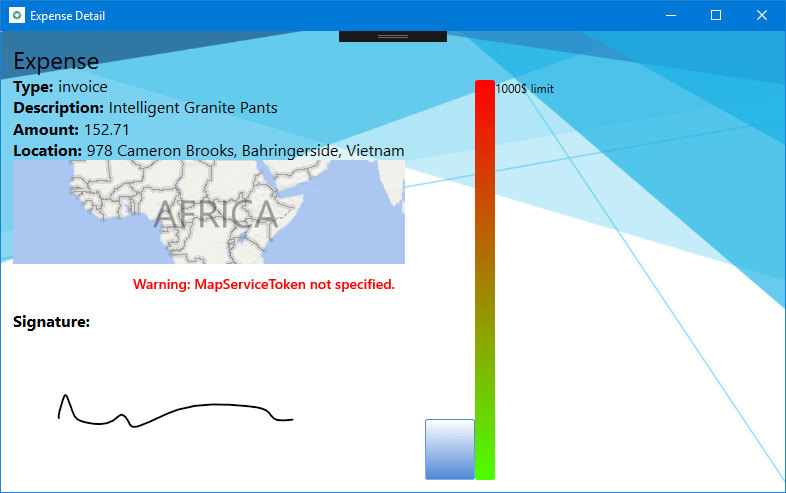
    
As you can see, everything is working as expected. However, the current version of the page isn't really useful. We are indeed seeing a map, but it isn't displaying the exact location where the expense happened. We need to interact with the control in code to achieve this goal. If we explore [the documentation about the MapControl](https://docs.microsoft.com/en-us/uwp/api/windows.ui.xaml.controls.maps.mapcontrol), we can see that it offers a method to center the map to a specifc point called **TrySetViewAsync()**. The method accepts multiple parameters, but the only required one are the coordinates of the location to display, provided with a [Geopoint](https://docs.microsoft.com/en-us/uwp/api/windows.devices.geolocation.geopoint) object.

The Windows Community Toolkit does a good job in supporting the **MapControl** and, as such, it provides some wrappers also for the most important classes which are required to work with it, including the **Geopoint** one. We can find it inside the **Microsoft.Toolkit.Win32.UI.Controls.Interop.WinRT** namespace:


> If you look at the properties exposed by the **Geopoint** class, can you understand which is the challenge we're about to face?

The **Geopoint** class represents geographic coordinates, like latitude and longitude. However, in our database we have only the information about the full address where the expense happened. How can we translate the address into coordinates?
[If we look at the documentation of the Universal Windows Platform](https://docs.microsoft.com/en-us/windows/uwp/maps-and-location/geocoding), we can find that it offers a class called **MapLocationFinder** which supports geocoding (converting an address into coordinates) and reverse geocoding (converting coordinates into an address).

Let's try to use it!

1. Go back to Visual Studio and double click on the **ExpenseDetail.xaml.cs** file in Solution Explorer
2. Locate the **Windows_Loaded** event handler, which contains the code that is esecuted when the window is loaded. It already contains some code to initialize the various information that are displayed in the page about the selected expense, like the type, the description, etc.
3. Move at the end of the event handler and try to reference the **MapLocationFinder** class:

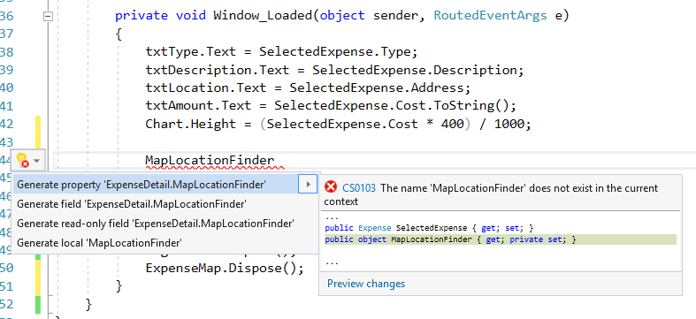

4. Notice how the class can't be found and even Visual Studio doesn't know where to find it. All the proposed quick actions, in fact, are about generating a new property / class / field since it doesn't exist.

> Can you guess why we aren't able to find the **MapLocationFinder** class?

The **MapLocationFinder** class is part of the Universal Windows Platform. Our application, instead, is a WPF application built on top of the .NET Framework. Thanks to the Windows Community Toolkit we have access to wrappers for some modern controls, but still we don't have access to all the APIs and features exposed by the Universal Windows Platform.
In the next exercise we're going to enhance our application so that we can use APIs from the Universal Windows Platform without rewriting it from scratch, thanks to a technology called Desktop Bridge.

In the next tasks we're going to make the **MapControl** we have added more useful, by actually displaying the location where the expense happened. However, as we have discovered at the end of the previous task, we first need to integrate the Universal Windows Platform in our application since the **MapLocationFinder** class, which can convert the address we have into a coordinate, is part of it.

### Task 2 - Package the application with the Desktop Bridge

Before doing this, we need to introduce the Desktop Bridge. Thanks to this technology, we can package our WPF application using the same format of the Universal Windows Platform, which is MSIX (formerly known as AppX, for versions of Windows 10 prior to 1809). Once the application is packaged, it gets an identity, which we'll allow us to integrate the Universal Windows Platform and use most of the available APIs without having to rewrite our WPF application from scratch.

Visual Studio offers an easy way to achieve this goal thanks to a template called **Windows Application Packaging Project**. Let's add it!

1. Open Visual Studio on the Contoso Expense project. If you didn't finish the previous exercise or you want to start from a clean solution, open in File Explore the folder *"Lab/Exercise2/01-Start/ContosoExpenses"* and double click on the **ContosoExpenses.sln** file.
2. Once the solution has been loaded, right click on the **ContosoExpenses** solution in **Solution Explorer** and choose **Add -> New project**.

    

3. Select the **Windows Universal** category under **Visual C#** and look for a template called **Windows Application Packaging Project**:

    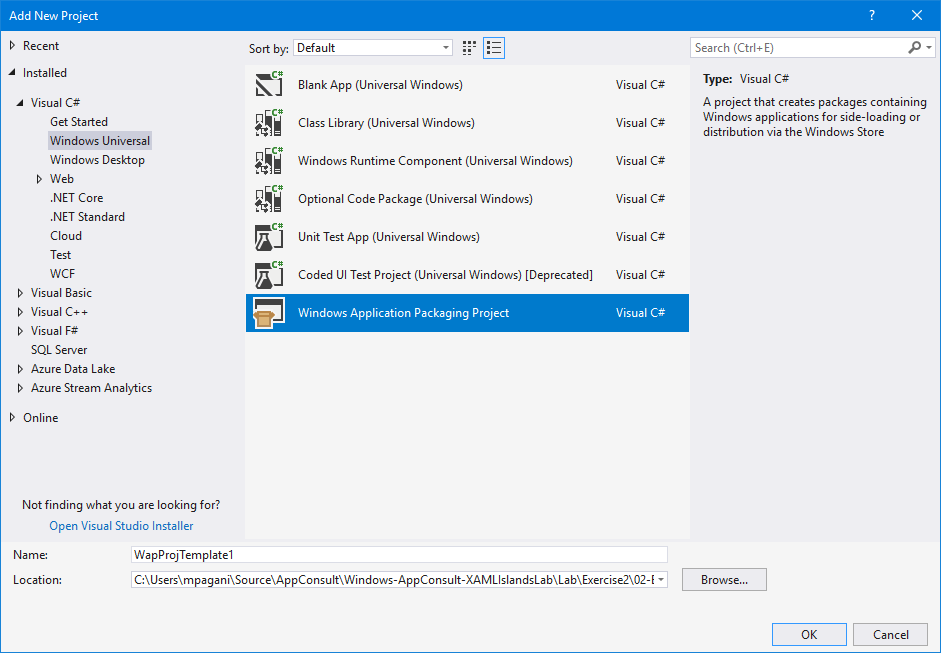
    
4. Name it **ContosoExpenses.Package** and press OK.
5. You will be asked which target SDK and minimum SDK you want to use:

    - **Target SDK** defines which APIs of the Universal Windows Platform you'll be able to use in your application. Choosing the most recent version will allow you to leverage all the latest and greates features offered by the platform.
    - **Minimum SDK** defines which is the minimum Windows 10 version you support. Lower versions won't be able to install this package. In case of a packaged Win32 application, the minimum supported version is Windows 10 Anniversary Update, since it was the first release to support the Desktop Bridge.
    
    For the purpose of our lab make sure to choose the most recent version for both options, as in the following picture:
    
    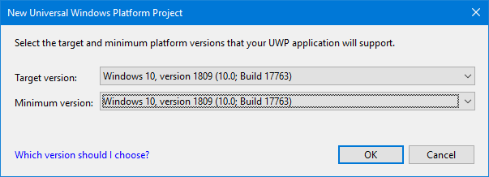
    
    Then press OK.
6. You will se a new project inside your Visual Studio solution, which structure will resemble the one of a Universal Windows Platform project:

    
    
    It has a manifest, which describes the application; it has some default assets, which are used for the icon in the Programs menu, the tile in the Start screen, the Store, etc. However, unlike a Universal Windows Platform project, it doesn't contain code. Its purpose is to package an existing Win32 application.
7. The project includes a section called **Applications**, which you can use to choose which applications included in your Visual Studio solution you want to include inside the package. Right click on it and choose **Add reference**.
8. You will see a list of all the other projects included in the solution which, currently, is only the **ContosoExpenses** application:

    
    
    Make sure to select it and press Ok.
9. Now expand the **Applications** section. You will notice that the **ContosoExpense** project is referenced and highlighted in bold, which means that it will be used as a starting point for the package. In case of a project with multiple executable, you can set the starting point by clicking on the correct one in the **Applications** list and choosing **Set as entry point**.  However, this isn't our case, so we are ready to go on.
10. That's it! We can now test the packaged version of the application.
11. Right click on the **ContosoExpenses.Package** project in Solution Explore and choose **Set As Startup Project**.
12. Press F5 to launch the debugging. 

Out of the box, you won't notice any meaningful difference. We have simply packaged our WPF application, so it's behaving like the traditional one. However, we can notice some small changes that can help us to understand the application is running as packaged:

- The icon in the taskbar or in the Start screen isn't anymore the icon of our application, but it's the default asset which is included in every UWP project.
- If we right click on the **ContosoExpense.Package** application listed in the Start menu, we will notice that we many options which are typically reserved to applications downloaded from the Microsoft Store, like **App settings**, **Rate and review** or **Share**.
    
    

- If we want to remove the application from the system, we can just right click again on his icon in the Start menu and choose **Uninstall**. After pressing Ok, the application will be immediately removed, without leaving any leftover on the system.

Now that our application has been packaged with the Desktop Bridge, we can start integrating the Universal Windows Platform.

### Task 3 - Add a reference to the Universal Windows Platform
In order to start using Universal Windows Platform APIs in a WPF application we need to add a reference to two files:

- **Windows.md**, which contains the metadata that describes all the APIs of the Universal Windows Platform.
- **System.Runtime.WindowsRuntime** which is a library that contains the infrastructure required to properly support the **IAsyncOperation** type, which is used by the Universal Windows Platform to handle asynchronous operation with the well known async / await pattern. Without this library your options to interact with the Universal Windows Platform would be very limited, since all the APIs which take more than 50 ms to return a result are implemented with this pattern.

1. Go back to Visual Studio and right click on the **ContosoExpenses** package.
2. Choose **Add reference**.
3. Press the **Browse** button.
4. Look for the following folder on the system: *"C:\Program Files (x86)\Windows Kits\10\UnionMetadata\10.0.17763.0\"*
5. Change the dropdown to filter the file types from **Component files** to **All files**. This way, the **Windows.md** file will become visible.

    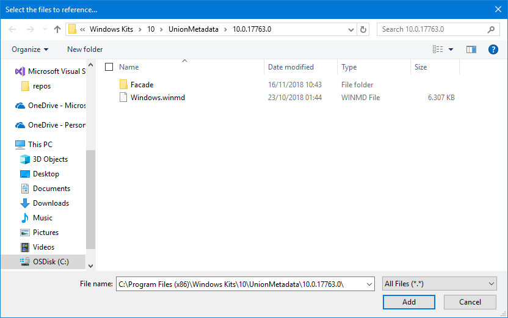
    
6. Select it and press **Add**.
7. Now press again the **Browse** button.
8. This time look for the following folder on the system: *"C:\Windows\Microsoft.NET\Framework\v4.0.30319"*
9. Look for a file called **System.Runtime.WindowsRuntime.dll**, select it and press Ok.
10. Now expand the **References** section of the **ContosoExpenses** project in Solution Explorer and look for the **Windows** reference.

    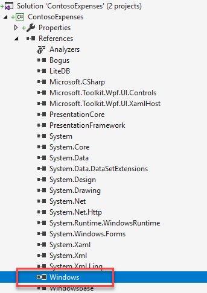
    
11. Select it, right it click on it and choose **Properties**.
12. Change the value of the **Copy Local** property from **True** to **False**.

    

You're all set. Now you're ready to start using APIs from the Universal Windows Platform.

### Task 4 - Display the expense location on the map
Now that we have enabled the Universal Windows Platform in our WPF project, we can start using the **MapLocationFinder** class we have mentioned before, which can help us to convert the address of the expense location to a set of coordinates we can use with the **MapControl**.

1. Go back to Visual Studio and double click on the **ExpenseDetail.xaml.cs** file in Solution Explorer
2. Add a reference to the correct namespace, by including the following statement at the top of the class:

    ```csharp
    using Windows.Services.Maps;
    ```
3. Look for the **Window_Loaded** event handler.
4. Copy and paste the following code at the end of the handler, after the initialization of the other controls in the page:

    ```csharp
    var result = await MapLocationFinder.FindLocationsAsync(SelectedExpense.Address, null);
    var location = result.Locations.FirstOrDefault();
    if (location != null)
    {
        await ExpenseMap.TrySetViewAsync(location.Point, 13);
    }
    ```
    
    The **MapLocatioNFinder** class exposes a method called **FindLocationAsync()** which is perfect for our scenario. As parameters, we need to pass the address we want to convert into coordinates and, optionally, a coordinate that can be used as a reference for the search. In our case, we pass the address of the current expense (stored in the **Address** property of the **SelectedExpense** object) and **null** as second parameter, since we don't have any coordinate to use as a reference. This method is asynchronous, so we need to invoke it with the **await** prefix.
    The method returns a list of possible locations, represented by the **MapLocation** object. We take the first result and, if it's not null, we call the **TrySetViewAsync()** method exposed by the **MapControl**. As parameter, we specify the location's coordinate (stored in the **Point** property) and the zoom level. Also this method is asynchronous, so we prefix the **await** keyword.
5. As it is, the code won't compile. We are using two asynchronous methods inside the event handler, but we haven't added the **async** prefix. Change the signature of the **Windows_Loaded** handler to include the **async** keyword. This is how the final event handler should look like:

    ```csharp
    private async void Window_Loaded(object sender, RoutedEventArgs e)
    {
        txtType.Text = SelectedExpense.Type;
        txtDescription.Text = SelectedExpense.Description;
        txtLocation.Text = SelectedExpense.Address;
        txtAmount.Text = SelectedExpense.Cost.ToString();
        Chart.Height = (SelectedExpense.Cost * 400) / 1000;
    
        var result = await MapLocationFinder.FindLocationsAsync(SelectedExpense.Address, null);
        var location = result.Locations.FirstOrDefault();
        if (location != null)
        {
            await ExpenseMap.TrySetViewAsync(location.Point, 13);
        }
    }
    ```

Now it's time to test the code!

1. Make sure that the **ContosoExpenses.Package** project in Solution Explorer is still set as startup project. Otherwise, right click on it and choose **Set As Startup Project**.
2. Press F5 to launch the debugging experience.
3. Choose any employee from the list, then one of the available expenses.
4. The detail page will open up and... the map will stay still like at the end of Exercise 1.
5. Close the window and try to open another expense. The map will continue to be stuck.

> Can you understand what's happening? Hint: the debugger can help!

Let's see what's happening.

1. Go back in Visual Studio and double click on the **ExpenseDetail.xaml.cs** file.
2. Set a breakpoint on the line immediately after the usage of the **MapLocationFinder.FindLocationsAsync()** method.
3. Now press again F5 to launch the debugging experience.
4. Choose any employee from the list, then one of the available expenses.
5. The detail page will open up. Wait for the breakpoint to be hit and explore the properties exposed by the **result** object:

    
    
As you can see, the **Status** property has the value **InvalidCredentials**. The **MapControl**, in fact, is subject to the Bing Maps licensing and, as such, many of these services can't be used without a valid license. You may have noticed another symptom of this requirement. When the application is running, below the **MapControl** you can see a red bold message stating **Warning: MapServiceToken not specified**.

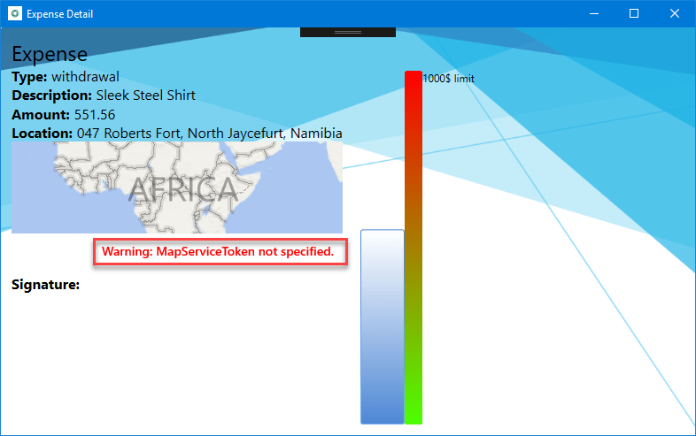

Let's move on and see how we can request a license and integrate it into our application.

1. Open a browser on your machine. If you're using the VM setup for this lab, you can use Microsoft Edge.
2. Go to the website [https://www.bingmapsportal.com/](https://www.bingmapsportal.com/).
3. Press the sign-in button.
4. Login with your personal Microsoft Account. It must be a personal account, like @outlook.com. You can't use an Office 365 account. In case you don't have one, feel free to skip the following steps. You will find a license to use later in the exercise.
5. Once you're logged in the main dashboard, choose **My account -> My keys**.

    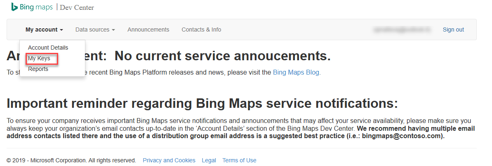
    
6. Click on the **here** link in the section **Click here** to create a new key.

    

7. Fill the following information:

    - **Application name**: feel free to choose the name you prefer.
    - **Application URL**: leave it empty.
    - **Key type**: choose **Basic**.
    - **Application type**: choose **Private Windows App (UWP, 8.x and earlier)**
    
    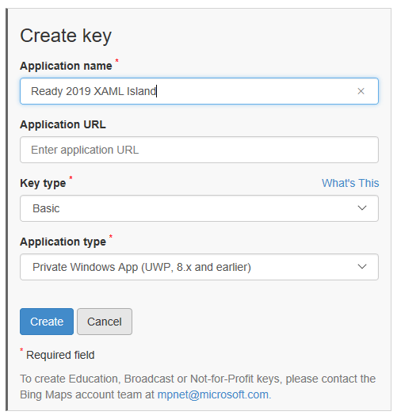
    
8. Press the **Create** button.
9. You will see a new item in the **My keys** section with all the info you have just provided.

    
    
10. Press the **Copy key** button. The key will be copied in the clipboard. If you want to reveal it, you can click on the **Show key** button.
11. Now go back to Visual Studio and double click on the **ExpenseDetail.xaml.cs** file in Solution Explorer.
12. Look for the constructor of the class, which is the **ExpenseDetail()** method.
13. Copy and paste the following code at the end of the method:

    ```csharp
    MapService.ServiceToken = "<add your key here>";
    ```

    Replace the string value with the key you have just copied from the Bing Dev portal. If you weren't able to retrieve a key, feel free to use the following one:
    
    ```csharp
    MapService.ServiceToken = "SstdhSuxgHWMVoqmrpla~PRzuxyU3RgB7e-csBqBIfA~AizgpHwv-MER89vjeuJ7LVP01a7gacUbusArACn1x7BcalbDhY23o0pt6L7AhZe";
    ```

14. Let's test the code again! Make sure that the **ContosoExpenses.Package** project is still selected as startup and press F5.
15. Choose one employee from the list, then one of the available expenses.
16. If you did everhting correctly, you should notice that:

    - After an animation, the map will be centered and zoomed on the location of the expense
    - The warning message under the **MapControl** will be gone
    
    
    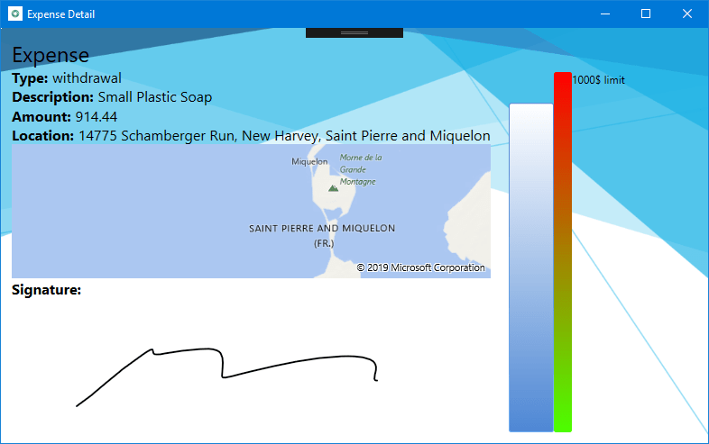

Great job! Now you have a WPF application which perfecly integrates two UWP controls, **InkCanvas** and **MapControl**. Additionally, since we have packed our application with the Desktop Bridge, we have the chance to leverage APIs from the Universal Windows Platform, to make it even more powerful. The Desktop Bridge opens up also the opportunity to release our application using the new MSIX format, which supports not only traditional deployment models (like web, SSCM, Intune, etc.) but also new ones like the Microsoft Store / Store for Business / Store for Education.


___
## Exercise 3 - Migrate to .NET Core
Migrating the application to .NET Core 3 is, from far, the best and recomanded path for modernazing a .NET application (WPF or Windows Forms). As previously mentionned, the first really nice improvment is about the startup and execution time! This is only the emerged part of the iceberg. The best advantage is that, the app will be able to use all the upcoming new features both from .NET Core and UWP! 

### Task 1 - Setup for using .NET Core
At the moment of writing .NET Core is still in Preview and it is highly experimental technologies. Nevertheless, it is enough stable to play with it. The minimum required is made of two pieces:
- The .NET Core 3 runtime - https://github.com/dotnet/core-setup
- The .NET Core 3 SDK - https://github.com/dotnet/core-sdk

Do not worry, using the VM provided, all is already setup for you: You do not have to download and install anything. On the other hand, if you are using you own computer, just navigate to the two links above and take the correct installer for your platform.


### Task 2 - Perform the migration - The csproj
As mentionned, .NET Core is in the Preview state. We also need a prelimenary version of Visual Studio. Again, the VM is setup for you and Visual Studio 2019 Preview is alreday installed. If you need to install it on your own box, here is the link: https://visualstudio.microsoft.com/fr/vs/preview/.

Let's open the solution using Visual Studio 2019 Preview:
1.  In Windows Explorer, navigate to `C:\XAMLIslandsLab\Lab\Exercise3\01-Start\ContosoExpenses` and double click on the `ContosoExpenses.sln` solution.
    
    The project ContosoExpenses is now open in Visual Studio but nothing changed: The appllication still uses the Full .NET 4.7.2. To verify this, just right click on the project in the Solution Explorer Windows and **Properties**.
    
    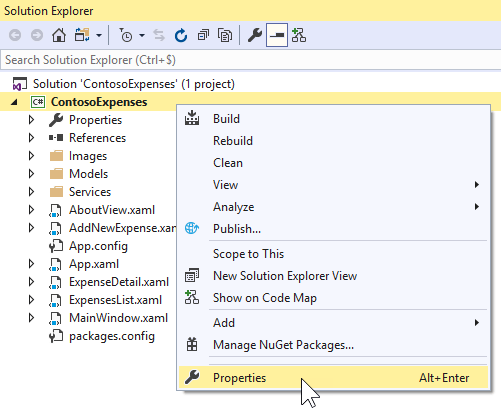

    The *Target framework* of the project is displayed in the **Application** tab.
    
    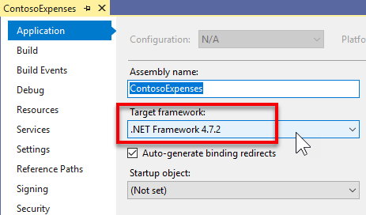

2.  Right click on the project in the solution explorer and choose **Unload Project**.

    

3.  Right click again on the project in the solution explorer ; click **Edit ContosoExpenses.csproj**.

    

4.  The content of the .csproj file looks like

    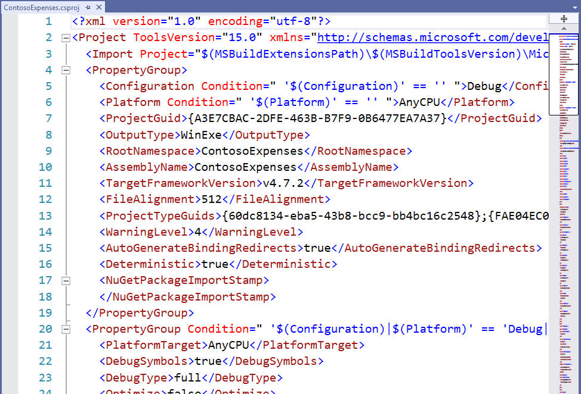

    Do not be afraid, it is not the time to understand the whole csproj structure. You will see that the migration will be done easely: Juste remove all the content of the file by doing **CTRL+A** and than  **SUPPR**!
    
    
    
5.  Start writing the new csproj file content by typing `<Project Sdk="Microsoft.NET.Sdk.WindowsDesktop"> </Project>` in the ContosoExpense.csproj. Microsoft.NET.Sdk.WindowsDesktop is the .NET Core 3 SDK for applications on Windows Desktop. It includes WPF and Windows Forms.

    

7.  Let's specify now a few details. To do this, insert a `<PropertyGroup></PropertyGroup>` element in inside the `<Project></Project>` element. 

    

8.  First, we indicate that the project output is a **executable** and not a dll. This is acheived by adding `<OutputType>WinExe</OutputType>` inside `<PropertyGroup></PropertyGroup>`.

> Note that, if the project output was a dll, this line has to be omitted.

9.  Secondly, we specify that the project is using .NET Core 3: Just below the <OutputType> line, add ` <TargetFramework>netcoreapp3.0</TargetFramework>`

10. Lastly, we point out that this is a WPF application in adding a third line: `<UseWPF>true</UseWPF>`.

> If the application is Windows Forms, we do not need this third line.

#### Summary, verification and last step

- The project using .NET Core 3 and the **Microsoft.NET.Sdk.WindowsDesktop** SDK
- Output is an **application** so we need the `<OutputType>` element
- `<UseWPF>` is self-describing

Here is the full content of the new csproj. Please double check that you have everything:

```xml
<Project Sdk="Microsoft.NET.Sdk.WindowsDesktop">

  <PropertyGroup>
    <OutputType>WinExe</OutputType>
    <TargetFramework>netcoreapp3.0</TargetFramework>
    <UseWPF>true</UseWPF>
  </PropertyGroup>

</Project>
```

It is now safe to save the csproj file. You can use **CTRL+S**.

### Task 3 - Perform the migration - Actions in the project

1.  The csproj is saved. Let's reopen the project: Go to the **Solution Explorer**, right click on the project and choose **Reload project**.

    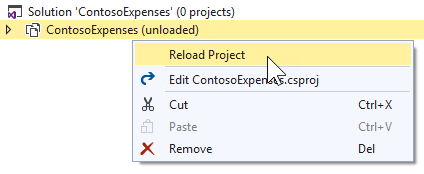
    
2.  Visual Studio just asks for a confirmation ; click **yes**.

    
    
3.  The project should load correctly. Let's try to build it in order to 'discover' the last steps to perform to complete the migration. Use the **Build** menu and **Build solution**.

    
    
4.  As expected, we have some errors. Open the **Output window** which is located in the bottom left of the Visual Studio window.

    

    


___
## Exercise - Integrate a custom UWP XAML component
TODO

### Task 1 - Reference the XAML Islands host conctrol
1.  With the ExpenseIt solution opened in Visual Studio, right click on the ExpenseIt project and then **Manage NuGet Packages...**

    

2.  Search for the "Microsoft.Toolkit.Wpf.UI.XamlHost" package.

    

3.  Click on the **Install** button.

    

___
## Exercise - Perform bindings between UWP XAML and WPF
TODO


